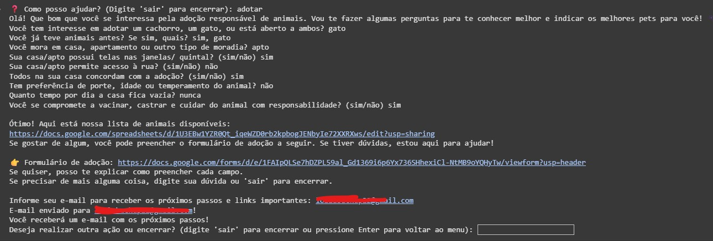
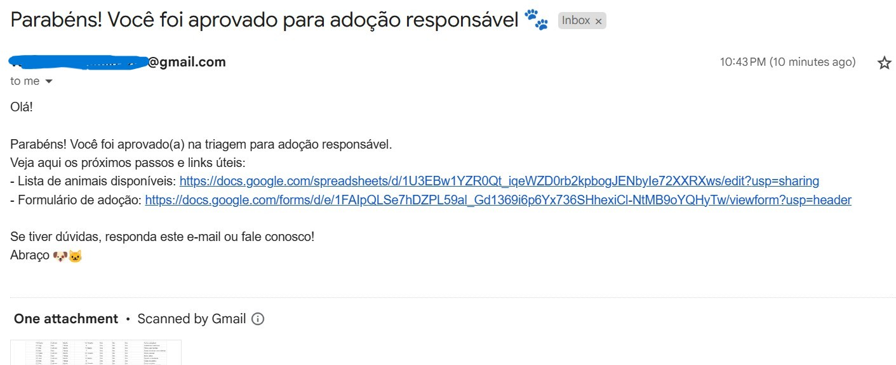

# 🐾 AdotAÍ - Agente de Adoção Responsável de Animais (IA Gemini)

Este projeto é um agente de IA criado para ajudar ONGs, protetores independentes e pessoas interessadas em adotar animais de forma responsável. O agente faz a triagem de adotantes, responde dúvidas sobre adoção, vacinação, castração, guarda responsável e outros temas.

---

## 💡 O que este agente faz?

- Realiza triagem inicial conversando com o interessado, coletando informações como:
  - Tipo de animal desejado
  - Experiências prévias
  - Ambiente onde vive
  - Expectativas e compromisso com adoção responsável
- Responde dúvidas frequentes sobre adoção, vacinação e castração
- Apresenta link da planilha de animais disponíveis e formulário de adoção
- Envia os próximos passos por e-mail, automatizando o atendimento inicial
- Incentiva a adoção responsável, sempre acolhedor e claro

---

## 📸 Prints do funcionamento

### 1. Fluxo de triagem e envio de e-mail  


### 3. Exemplo de e-mail recebido  


---

## 🚀 Como rodar no Google Colab

1. **Abra o notebook no Google Colab**  
   Exemplo:  
   [agentAI_adocao_animais.ipynb](link_para_seu_notebook_se_existir)

2. **Configure as variáveis de ambiente logo no início do notebook**  
   Insira e execute este bloco antes de qualquer outro:

   ```python
   import os
   os.environ['EMAIL_REMETENTE'] = "SEU_EMAIL_DO_GMAIL_AQUI"
   os.environ['SENHA_EMAIL_APP'] = "SUA_SENHA_DE_APP_GMAIL"
   # Se usar Gemini:
   # os.environ["GOOGLE_API_KEY"] = "SUA_API_KEY_GEMINI"
   ```
   - **Para enviar e-mails pelo Gmail, gere uma [senha de app do Google](https://support.google.com/accounts/answer/185833?hl=pt-BR).**  
   - Nunca coloque sua senha real do Gmail, use apenas senha de app!
   - Veja como gerar uma senha de app:  
     [Guia oficial do Google](https://support.google.com/accounts/answer/185833?hl=pt-BR)

   - Para usar Gemini (opcional), obtenha a API Key:  
     [Documentação Gemini API](https://ai.google.dev/tutorials/python_quickstart)

3. **Execute o restante das células normalmente**  
   O agente fará perguntas, apresentará links e enviará um e-mail com os próximos passos, conforme o fluxo da triagem.

---

## 📨 Como funciona o envio de e-mail?

- O usuário que passar pela triagem será convidado a informar seu e-mail.
- O sistema envia automaticamente os links de animais disponíveis e o formulário de adoção para o e-mail informado.
- O envio só funciona se as variáveis `EMAIL_REMETENTE` e `SENHA_EMAIL_APP` estiverem corretamente configuradas.

---

## 📝 Exemplo de uso

```
❓ Como posso ajudar? (Digite 'sair' para encerrar): adotar
Olá! Que bom que você se interessa pela adoção responsável de animais. Vou te fazer algumas perguntas para te conhecer melhor e indicar os melhores pets para você! 🐾
[... perguntas da triagem ...]
Informe seu e-mail para receber os próximos passos e links importantes: exemplo@email.com
E-mail enviado para exemplo@email.com!
Você receberá um e-mail com os próximos passos!
🤖 Agente de Adoção Animal 🤖
Olá! Sou seu assistente virtual para adoção de animais. Vamos conversar?
❓ Como posso ajudar? (Digite 'sair' para encerrar):
```

---

## 📋 Links importantes

- [Planilha de animais disponíveis](https://docs.google.com/spreadsheets/d/1U3EBw1YZR0Qt_iqeWZD0rb2kpbogJENbyIe72XXRXws/edit?usp=sharing)
- [Formulário de adoção](https://docs.google.com/forms/d/e/1FAIpQLSe7hDZPL59al_Gd1369i6p6Yx736SHhexiCl-NtMB9oYQHyTw/viewform?usp=header)

---

## ⚠️ Observações de segurança

- **Nunca compartilhe sua senha de app ou e-mail real em repositórios públicos.**
- Recomenda-se remover ou mascarar dados sensíveis antes de compartilhar o notebook/publicar no GitHub.

---

## 🛠️ Requisitos

- Python 3.8+
- Bibliotecas: `smtplib`, `email`, (eventualmente, `google.generativeai` para Gemini, se usar IA)
- Conta Gmail com senha de app habilitada

---

## 📖 Links úteis e documentação

- [Como gerar senha de app no Google (Gmail)](https://support.google.com/accounts/answer/185833?hl=pt-BR)
- [Documentação Gemini API (Google AI Studio)](https://ai.google.dev/tutorials/python_quickstart)
- [Python - Enviando e-mails com smtplib](https://docs.python.org/3/library/smtplib.html)
- [Python - EmailMessage](https://docs.python.org/3/library/email.message.html)

---

## 📖 Licença

MIT

---

> Projeto desenvolvido durante a [Imersão IA](https://imersaoia.alura.com.br/) (Alura + Google Gemini).
